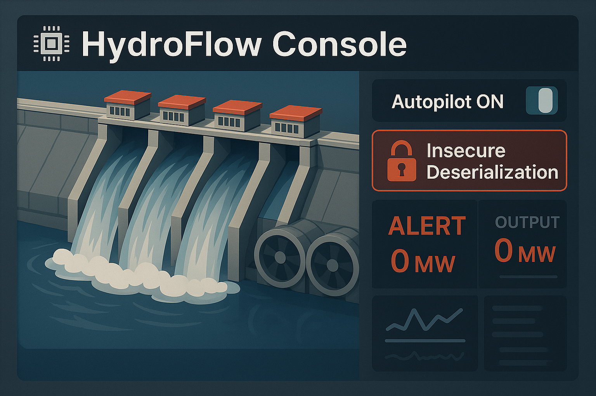

# HydroFlow Console

<p align="center">
  
</p>

**HydroFlow Console** is a didactic simulator of a hydroelectric control panel. It mimics the physical behavior of a dam with turbines, gates, and environmental conditions. The application includes a deliberately insecure implementation of session handling using `pickle` and is meant for educational use only.


## 🚀 Installation

```bash
pip install -r requirements.txt
python app.py
````

Access the login page at `/login`. Only user `l.perez` can log in without a password. After login, go to `/dashboard` to see the control panel. Use `/logout` to sign out. The homepage `/` displays a welcome page with team info.


## 🔐 Authentication

The login form collects a username and password. A valid login generates a `session` cookie with a dictionary containing the username and role (`viewer`, `engineer`, or `admin`). The cookie is serialized with `pickle` and base64-encoded. On `/dashboard`, this cookie is deserialized to control user access.


## 🧪 Cookie Exploitation

Since the session cookie is not signed or encrypted, it can be manipulated. By decoding it from base64, editing the `role`, and re-encoding it, you can escalate privileges. For example, changing `role: viewer` to `admin` gives full access.

> ⚠️ You might try decoding the `session` cookie with a tool like Python or CyberChef, and you’ll likely see something readable like:
>
> ```python
> {'user': 'john.doe', 'role': 'viewer'}
> ```
>
> But if you edit that, change `'viewer'` to `'admin'`, re-encode it in base64 and send it back... the server **still won't accept it**. Why?
>
> Because `pickle` uses a **binary serialization format**, not plain text. Simply editing the readable string can break the structure internally.
>
> Any mismatch in length, type, or structure will make `pickle.loads()` throw an exception.
>
> This demonstrates that although the cookie isn't signed or encrypted, **it's not trivial to tamper with** unless you recreate the binary payload properly using Python.


The deserialization uses:

```python
pickle.loads(base64.b64decode(request.cookies.get("session")))
```

This is insecure by design and allows injection of malicious objects if not properly validated.


## ⚙️ Simulation and Physical Model

At launch, all gates are closed, and turbines are off. A background thread updates the simulation every 3 seconds.

### Constants and Variables

* `NUM_GATES` = 5
* `MAX_LEVEL` = 250 m
* `DAM_AREA` = 1000 m²
* `WATER_DENSITY` = 1000 kg/m³
* `GRAVITY` = 9.81 m/s²
* `RPM_MIN` = 2000, `RPM_WARN` = 4500, `RPM_MAX` = 5000
* `PRESSURE_MAX` = 100 bar
* `POWER_MAX` = 200 MW

### Weather and Inflow

Random weather affects inflow:

* Sunny → 0.2 m³/s
* Rain → 1.0 m³/s
* Heavy rain → 2.7 m³/s + 60s timer

### Water Dynamics

Outflow depends on open gates:

```python
flow = open_gates * 1.0
water_level += inflow - flow
```

Pressure is calculated:

```python
pressure = water_level * 1.12
```


### Turbines and Power

Turbines activate if more than two gates are open:

```python
target_rpm = max(pressure * 8, RPM_MIN)
```

Each 1000 rpm adds 1 °C to turbine temp. Power output:

```python
P = ρ * g * Q * H / 1_000_000
```


### Failure Conditions

* **Dam collapse**: pressure > 100 bar or overflow for over 60s
* **Overload**: power > 200 MW

Triggers a 500 error with `flag{electric_power}`.


## 💻 Interface

The dashboard uses Bootstrap and Chart.js to show:

* Water level
* Pressure
* Outflow
* RPM & temperature
* Generated power

Admins can open/close gates and update firmware. Weather includes humidity and wind. A mini-navbar displays the logged user and logout option.


## ⚙️ Firmware & Autopilot

The autopilot keeps pressure between 45–55 bar. It can be toggled by uploading a `firmware7331.bin` file to `/firmware/update` with these lines:

```
autopilot: on
warnings: on
```

Admins have a shortcut to the update page. The default firmware is included in `firmware_uploads/`.


## 🧑‍💻 Exploit Scripts

In the `Exploit/` folder:

* `exploit.py`: uses Selenium to hijack a browser, modify the cookie, and upload firmware.
* `exploitv2.py`: uses `urllib` to forge a cookie, disable autopilot, and trigger a system fail.

Both demonstrate the security flaws via manipulated cookies and firmware.


## 🛑 Disclaimer

**This project is for educational use only.** Never use `pickle` with user-controlled data in real applications.


## 🧑 Author

Created by **Jordi Serrano (@j0rd1s3rr4n0)**


# HydroFlow Console (español)

**HydroFlow Console** es un simulador didáctico del panel de control de una central hidroeléctrica. Recrea el comportamiento físico de una presa con turbinas, compuertas y condiciones meteorológicas. La aplicación incluye una vulnerabilidad intencionada basada en `pickle`, pensada para fines educativos.


## 🚀 Instalación

```bash
pip install -r requirements.txt
python app.py
```

Accede a `/login` e introduce usuario y contraseña (solo `l.perez` puede entrar sin contraseña). Luego abre `/dashboard`. Usa `/logout` para cerrar sesión. La página principal (`/`) muestra un mensaje de bienvenida y el equipo.


## 🔐 Autenticación

El login genera una cookie `session` con un diccionario que contiene nombre de usuario y rol (`viewer`, `engineer` o `admin`). Esta cookie se serializa con `pickle` y se codifica con base64. Al entrar en `/dashboard`, se decodifica y se otorgan permisos según el rol.


## 🧪 Explotación de la cookie

Como la cookie no está firmada ni cifrada, se puede manipular. Basta con decodificarla desde base64, cambiar `role` a `admin`, volver a codificarla y recargar. 

> ⚠️ Puedes intentar decodificar la cookie `session` usando Python o CyberChef, y verás algo como:
>
> ```python
> {'user': 'john.doe', 'role': 'viewer'}
> ```
>
> Pero si modificas `'viewer'` por `'admin'`, vuelves a codificarla en base64 y la envías… el servidor **no la acepta**. ¿Por qué?
>
> Porque `pickle` utiliza un **formato binario**, no texto plano. Al cambiar manualmente el contenido, puedes romper su estructura interna.
>
> Si la longitud o el tipo no coinciden, `pickle.loads()` lanzará una excepción.
>
> Esto demuestra que, aunque la cookie no esté firmada ni cifrada, **no es tan fácil manipularla a mano** si no sabes recrear el binario con precisión.


El servidor la deserializa con:

```python
pickle.loads(base64.b64decode(request.cookies.get("session")))
```

Esto es inseguro por diseño y permite incluso inyección de objetos maliciosos.


## ⚙️ Simulación y modelo físico

Al arrancar, todas las compuertas están cerradas y las turbinas apagadas. Un hilo de fondo actualiza el estado cada 3 segundos.

### Constantes y variables

* `NUM_GATES` = 5
* `MAX_LEVEL` = 250 m
* `DAM_AREA` = 1000 m²
* `WATER_DENSITY` = 1000 kg/m³
* `GRAVITY` = 9.81 m/s²
* `RPM_MIN` = 2000, `RPM_WARN` = 4500, `RPM_MAX` = 5000
* `PRESSURE_MAX` = 100 bar
* `POWER_MAX` = 200 MW


### Clima e inflow

Cada ciclo genera un clima aleatorio:

* Soleado → 0.2 m³/s
* Lluvia → 1.0 m³/s
* Lluvia fuerte → 2.7 m³/s + temporizador de 60s


### Dinámica del agua

El caudal depende del número de compuertas abiertas:

```python
flow = open_gates * 1.0
water_level += inflow - flow
```

La presión se calcula así:

```python
pressure = water_level * 1.12
```


### Turbinas y potencia

Si hay más de dos compuertas abiertas:

```python
target_rpm = max(pressure * 8, RPM_MIN)
```

Cada 1000 rpm añade 1 °C. La potencia generada:

```python
P = ρ * g * Q * H / 1_000_000
```


### Condiciones de fallo

* **Colapso de presa**: presión > 100 bar o desbordamiento constante
* **Sobrecarga eléctrica**: potencia > 200 MW

Activa error 500 con `flag{electric_power}`.


## 💻 Interfaz

El dashboard usa Bootstrap y Chart.js para mostrar:

* Nivel de agua
* Presión
* Caudal
* RPM y temperatura
* Potencia generada

Admins pueden abrir compuertas y subir firmware. El clima incluye humedad y viento. Hay una cabecera con usuario y logout.


## ⚙️ Firmware y autopilot

El autopilot mantiene la presión entre 45 y 55 bar. Se puede desactivar subiendo un fichero `firmware7331.bin` a `/firmware/update` con:

```
autopilot: on
warnings: on
```

El firmware por defecto está en `firmware_uploads/`.


## 🧑‍💻 Scripts de exploit

En la carpeta `Exploit/`:

* `exploit.py`: usa Selenium para modificar la cookie y subir firmware.
* `exploitv2.py`: usa `urllib` para escalar privilegios y desactivar el autopilot.

Demuestran cómo modificar la lógica de la app sin autenticación real.


## ⚠️ Aviso legal

**Este proyecto es solo para fines educativos.** No uses `pickle` con datos controlados por el usuario en apps reales.


## 👤 Autor

Creado por **Jordi Serrano (@j0rd1s3rr4n0)**
<!-- [LinkedIn](https://www.linkedin.com/in/tramunthack) | [X (Twitter)](https://x.com/tramunthack)-->
